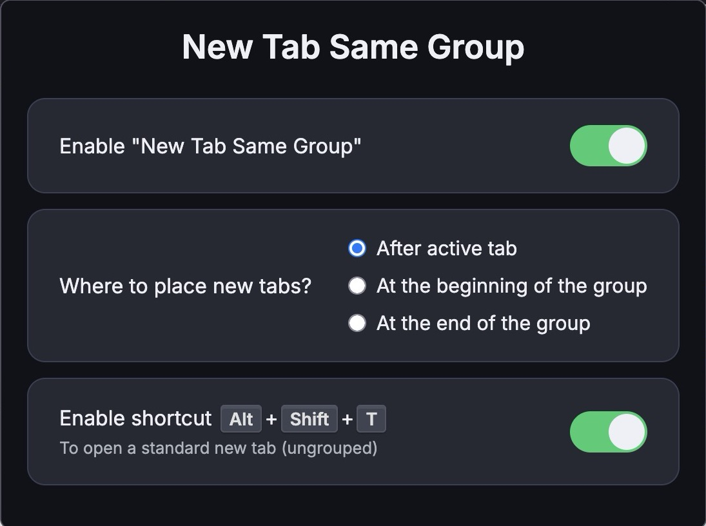

# New Tab Same Group

**Version 1.3.1**

**New Tab Same Group** is a Firefox extension that improves tab organization by automatically inserting new tabs into the same group as your current active tab — right after it, at the beginning, or at the end of the group, based on your preference.
This extension only works with **native tab grouping** (Firefox 138+).

---

## 🚀 Features

- ✅ Automatically groups new tabs with the active one
- 🎯 Choose where new tabs are inserted:
  - **After active tab** (default)
  - **At the beginning** of the current group
  - **At the end** of the current group
- ⌨️ **NEW:** Optional keyboard shortcut (`Alt+Shift+T` by default) to open a new tab in the standard Firefox way, without applying grouping logic. This can be toggled in the extension's options.
- 🧠 Smarter tracking of the active tab for reliable grouping across windows
- 🖤 Fully supports Firefox's native tab groups
- 🔒 Zero tracking, zero external dependencies
- 🧩 Works perfectly with both **vertical tab layouts** and **classic horizontal tabs**

---

## 📸 Screenshots

*Screenshot of the options panel, including the new toggle for the standard tab shortcut.*

---

## 🛠 Requirements

- Firefox 138 or higher
- The browser’s native tab grouping system must be enabled

---

## ⚙️ How to Enable Tab Groups in Firefox

This extension works with both **classic horizontal tabs** and **vertical tabs in the sidebar**.

If you don’t see tab groups:

- Open the sidebar via `F9` or View → Sidebar → Tabs
- Right-click on a tab and choose **Move Tab to New Group**

### If tab grouping is missing entirely:

1. Go to `about:config`
2. Search for `browser.tabs.grouping.enabled`
3. If it exists, set it to `true`
4. Restart Firefox

> 🟣 Note: This extension only works with **native tab grouping**, not third-party tab managers.

---

## ⌨️ Keyboard Shortcut for Standard New Tab

You can enable a keyboard shortcut (`Alt+Shift+T` by default) in the extension's options to open a new tab that bypasses the extension's grouping logic. This is useful if you occasionally want a new tab to open with Firefox's default behavior.

You can customize this shortcut via Firefox's "Manage Extension Shortcuts" menu:
1. Go to `about:addons`.
2. Click the gear icon ⚙️ in the top-right corner.
3. Select "Manage Extension Shortcuts".
4. Find "New Tab Same Group" and customize the "Open a standard new tab (not managed by the extension)" shortcut.
   You can also open this settings page directly from the extension's options by clicking the **Customize shortcut…** link.

---

## 🧩 Installation

Download from [addons.mozilla.org](https://addons.mozilla.org/en-US/firefox/addon/new-tab-same-group/) (Link will point to the latest version once published)

---

## 📝 License

MIT — see [`LICENSE.txt`](LICENSE.txt)
